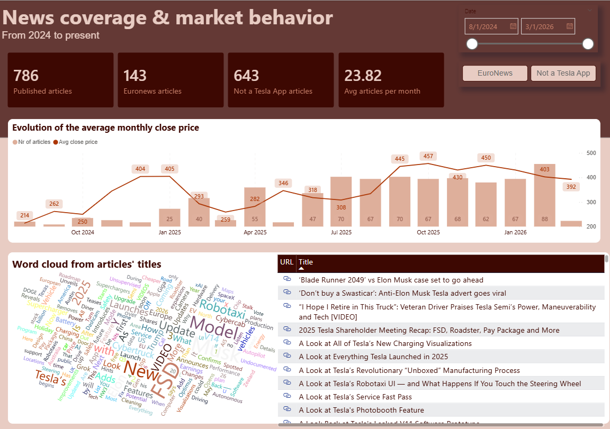

<div align="center">

# 🚗 Tesla DataOps Pipeline

**End-to-end ELT pipeline for Tesla stock prices and news articles — from web scraping & API extraction to analytical tables, fully orchestrated with Apache Airflow.**

[](https://www.python.org/)
[](https://airflow.apache.org/)
[](https://www.getdbt.com/)
[](https://www.postgresql.org/)
[](https://docs.docker.com/compose/)
[](https://docs.pydantic.dev/)

</div>

## 📋 Table of Contents

- [Overview](#-overview)
- [Power BI Dashboards](#-power-bi-dashboards)
- [Getting Started](#-getting-started)
- [Tech Stack](#-tech-stack)
- [Architecture](#-architecture)
- [Data Sources](#-data-sources)
- [Medallion Architecture (Bronze → Silver → Gold)](#-medallion-architecture-bronze--silver--gold)
- [Airflow DAGs](#-airflow-dags)
- [Infrastructure](#-infrastructure)
- [Project Structure](#-project-structure)
- [Data Quality & Testing](#-data-quality--testing)
- [Documentation](#-documentation)

## 🎯 Overview

This project implements a **production-grade DataOps pipeline** that collects, processes, and transforms Tesla-related data from multiple sources into analytical tables ready for dashboarding and analysis.

**Key highlights:**

- **Automated data extraction** from 3 sources (REST API + 2 web scrapers)
- **Medallion architecture** (Bronze → Silver → Gold) with dbt transformations
- **Full orchestration** via Apache Airflow with parallel task execution
- **Data validation** at multiple layers — Pydantic schemas, dbt tests, and pytest
- **Containerized infrastructure** — one `docker-compose up` to run everything
- **Idempotent loads** — conflict-handling strategies ensure safe re-runs

## 📈 Power BI Dashboards

**End Goal:** Transform raw data into actionable business intelligence.

### 1. Tesla Stock & Media Activity Overview


### 2. News Coverage & Market Behavior


## 🚀 Getting Started

### Prerequisites

- [Docker](https://www.docker.com/) & Docker Compose
- [Alpha Vantage API key](https://www.alphavantage.co/support/#api-key) (free)

### 1. Clone & Configure

```bash
git clone https://github.com/<your-username>/projeto-dataops.git
cd projeto-dataops
cp .env-example .env   # fill in your credentials
```

### 2. Start Infrastructure

```bash
docker-compose up -d
```

### 3. Create Airflow Admin User (first time only)

```bash
docker exec airflow_webserver_dataops airflow users create \
  --username admin --password admin \
  --firstname Admin --lastname User \
  --role Admin --email admin@example.com
```

### 4. Access the Services

| Service | URL |
|:---|:---|
| **Airflow** | [http://localhost:8080](http://localhost:8080) |
| **pgAdmin** | [http://localhost:5051](http://localhost:5051) |

### 5. Trigger Pipelines

Enable the DAGs in the Airflow UI, or trigger them manually:

```bash
# Run dbt transformations manually
docker exec dbt_to_postgres_dataops sh -c "cd /usr/app && dbt run --profiles-dir /root/.dbt"

# Run dbt tests
docker exec dbt_to_postgres_dataops sh -c "cd /usr/app && dbt test --profiles-dir /root/.dbt"
```

### 6. Run Python Tests

```bash
pip install -r requirements.txt
python -m pytest tests/ -v
```

## 🛠 Tech Stack

| Layer | Technology | Purpose |
|:---|:---|:---|
| **Extraction** | Python 3.11, Requests, BeautifulSoup, Selenium | API calls and web scraping |
| **Validation** | Pydantic 2.x | Schema enforcement on API responses |
| **Storage** | PostgreSQL 15 | Data warehouse (Bronze/Silver/Gold schemas) |
| **Transformation** | dbt-postgres 1.8 | SQL-based transformations with Medallion Architecture |
| **Orchestration** | Apache Airflow 2.9.3 | DAG scheduling and pipeline management |
| **Infrastructure** | Docker Compose (6 services) | Reproducible, containerized environment |
| **Testing** | pytest + dbt tests | Unit tests and data quality checks |
| **DB Admin** | pgAdmin 4 | Database management UI |

## 🏗 Architecture

```
┌──────────────────────────────────────────────────────────┐
│                    DATA SOURCES                          │
│                                                          │
│  Alpha Vantage API    notateslaapp.com    euronews.com   │
│   (REST + Pydantic)   (BeautifulSoup)      (Selenium)   │
└──────────┬──────────────────┬──────────────────┬─────────┘
           │                  │                  │
           ▼                  ▼                  ▼
┌──────────────────────────────────────────────────────────┐
│                  LOCAL FILE STORAGE                       │
│         data/stocks/*.json    data/tesla_news/*.csv       │
└──────────────────────────┬───────────────────────────────┘
                           │  Python (psycopg2 + pandas)
                           ▼
┌──────────────────────────────────────────────────────────┐
│                     POSTGRESQL 15                         │
│                                                          │
│  ┌─────────┐      ┌──────────┐      ┌─────────────────┐ │
│  │ BRONZE  │ dbt  │  SILVER  │ dbt  │      GOLD       │ │
│  │ (raw)   │ ───► │ (views)  │ ───► │    (tables)     │ │
│  │         │      │ cleaned  │      │   aggregated    │ │
│  │         │      │ typed    │      │   metrics       │ │
│  │         │      │ deduped  │      │                 │ │
│  └─────────┘      └──────────┘      └─────────────────┘ │
└──────────────────────────────────────────────────────────┘
                           │
          Orchestrated by Apache Airflow
```

##  Data Sources

| Source | Method | Schedule | Output |
|:---|:---|:---|:---|
| [Alpha Vantage API](https://www.alphavantage.co/) | REST API + Pydantic validation | Monthly | `data/stocks/stocks_data_tesla.json` |
| [notateslaapp.com](https://www.notateslaapp.com) | Web scraping (Requests + BeautifulSoup) | Monthly | `data/tesla_news/notateslaapp_YYYY_MM.csv` |
| [euronews.com](https://euronews.com) | Web scraping (Selenium headless Chrome) | Monthly | `data/tesla_news/euronews_YYYY_MM.csv` |

### Extraction Details

- **Stock data**: Monthly adjusted time series from Alpha Vantage, validated with a Pydantic `ApiResponse` model before persistence
- **News (source 1)**: Pagination-based scraping with deduplication via `seen_links` set; CSVs are partitioned by `(year, month)` and appended incrementally
- **News (source 2)**: Headless Selenium automation with CSS selectors; filters articles containing "Tesla", "Elon", or "Musk"

## 🥇 Medallion Architecture (Bronze → Silver → Gold)

### Bronze — Raw Ingestion

Raw data loaded as-is from files into PostgreSQL tables using `psycopg2` with `execute_values` for bulk inserts.

| Table | PK / Unique Constraint | Load Strategy |
|:---|:---|:---|
| `bronze_news` | `bigserial` PK + unique on `(source, title, date_raw)` | `ON CONFLICT DO NOTHING` — immutable data |
| `bronze_stock_data` | `date TEXT` PK | `ON CONFLICT DO UPDATE` — mutable data |

### Silver — Cleaned & Deduplicated (dbt views)

SQL views that cast types, trim whitespace, and deduplicate using `ROW_NUMBER() OVER (PARTITION BY ... ORDER BY ingested_at DESC) = 1`.

| Model | Source | Deduplication Key |
|:---|:---|:---|
| `silver_news` | `bronze_news` | `(source, title, date_raw)` |
| `silver_stock_data` | `bronze_stock_data` | `trade_date` |

### Gold — Analytical Tables (dbt tables)

Aggregated, business-ready metrics materialized as tables.

| Model | Description | Key Metrics |
|:---|:---|:---|
| `gold_news_info` | Curated news articles | `published_date`, `title`, `link`, `source` |
| `gold_news_monthly_summary` | Monthly news aggregation per source | `total_articles`, `distinct_days_with_articles`, `avg_articles_per_day` |
| `gold_stock_monthly_summary` | Monthly stock aggregation | `month_low`, `month_high`, `avg_close_price`, `total_volume`, `total_dividends`, `trading_days` |

## ⚙ Airflow DAGs

### `news_pipeline` — Monthly

```
[scrape_notateslaapp, scrape_euronews]   ← parallel extraction
                  │
                  ▼
          load_news_data                 ← CSVs → PostgreSQL bronze
                  │
                  ▼
        dbt_run_silver_news              ← clean + deduplicate
                  │
                  ▼
         dbt_run_gold_news               ← aggregate
                  │
                  ▼
          dbt_test_news                  ← data quality checks
```

### `stock_pipeline` — Monthly (1st at 06:00 UTC)

```
        extract_stock_data               ← Alpha Vantage API
                  │
                  ▼
         load_stock_data                 ← JSON → PostgreSQL bronze
                  │
                  ▼
      dbt_run_silver_stock               ← cast types + deduplicate
                  │
                  ▼
       dbt_run_gold_stock                ← monthly aggregation
                  │
                  ▼
         dbt_test_stock                  ← data quality checks
```

**Design decisions:**
- `BashOperator` chosen over `PythonOperator` for script isolation and Docker-in-Docker dbt execution
- Parallel scraping tasks reduce pipeline wall time
- Each DAG includes a final `dbt test` step as a quality gate

## ✅ Data Quality & Testing

### dbt Schema Tests

| Model | Column Tests |
|:---|:---|
| `silver_stock_data` | `trade_date` — unique, not_null |
| `silver_news` | `published_date`, `title`, `link`, `source` — not_null |
| `gold_news_info` | `link` — unique, not_null; all columns — not_null |
| `gold_stock_monthly_summary` | `month` — unique, not_null |
| `gold_news_monthly_summary` | `source`, `month` — not_null |

### dbt Singular Tests

| Test | Validates |
|:---|:---|
| `assert_stock_values_not_negative` | All prices, volume, and dividends in Silver ≥ 0 |
| `assert_gold_stock_values_not_negative` | All aggregated values in Gold ≥ 0 |

### Python Unit Tests (pytest)

| Test File | Coverage |
|:---|:---|
| `test_schemas.py` | Pydantic model validation — valid parsing, missing field rejection |
| `test_load_news.py` | CSV column validation — required columns detection |

```bash
python -m pytest tests/ -v
```

## 🐳 Infrastructure

Six Docker Compose services with health checks and proper dependency ordering:

```
database (PostgreSQL 15 — healthcheck: pg_isready)
    ├── pgadmin (web UI :5051)
    ├── dbt (run on demand)
    └── airflow-init (db migrate → exit)
            ├── airflow-webserver (:8080)
            └── airflow-scheduler
```

| Service | Container | Port | Description |
|:---|:---|:---|:---|
| `database` | `postgres_database_dataops` | 5432 | PostgreSQL 15 with healthcheck |
| `pgadmin` | `pgadmin_service_dataops` | 5051 | Database admin web UI |
| `dbt` | `dbt_to_postgres_dataops` | — | dbt-postgres 1.8 (run on demand) |
| `airflow-init` | `airflow_init_dataops` | — | Database migration on startup |
| `airflow-webserver` | `airflow_webserver_dataops` | 8080 | Airflow web UI |
| `airflow-scheduler` | `airflow_scheduler_dataops` | — | DAG scheduling |

## 📁 Project Structure

```
projeto-dataops/
│
├── docker-compose.yml                # 6 services: Postgres, pgAdmin, dbt, Airflow
├── .env                              # Credentials (not committed)
├── requirements.txt                  # Python dependencies
│
├── extract/                          # 🔍 Data extraction layer
│   ├── collect_api_data.py           #    Alpha Vantage REST API + Pydantic
│   ├── web_scrap_tesla_news_source1.py   #    notateslaapp (Requests + BS4)
│   └── web_scrap_tesla_news_source2.py   #    euronews (Selenium headless)
│
├── models/                           # 📐 Pydantic schemas
│   └── schemas.py                    #    MonthlyBar + ApiResponse models
│
├── load/                             # 📥 Bronze layer loaders
│   ├── load_news.py                  #    CSVs → bronze.bronze_news (chunked)
│   └── load_stocks.py                #    JSON → bronze.bronze_stock_data
│
├── data/                             # 💾 Raw data files
│   ├── stocks/                       #    Stock JSON (monthly adjusted)
│   └── tesla_news/                   #    News CSVs (partitioned by month)
│
├── dbt/                              # 🔄 dbt transformation project
│   ├── profiles/profiles.yml         #    Connection config (env_var based)
│   └── tesla_dbt_proj/
│       ├── models/
│       │   ├── sources.yml           #    Bronze source definitions
│       │   ├── silver/               #    Cleaned/typed/deduped views
│       │   └── gold/                 #    Aggregated analytical tables
│       ├── tests/                    #    Singular tests (not_negative)
│       └── macros/                   #    generate_schema_name override
│
├── airflow/                          # 🔁 Orchestration
│   ├── Dockerfile                    #    Custom image (Chromium + Python deps)
│   └── dags/
│       ├── dag_news_pipeline.py      #    Scrape → Load → Transform (news)
│       └── dag_stock_pipeline.py     #    Extract → Load → Transform (stocks)
│
└── tests/                            # 🧪 Python unit tests
    ├── test_schemas.py               #    Pydantic model tests
    └── test_load_news.py             #    CSV validation tests
```

##  Documentation

Each module has its own detailed README:

| Module | Documentation |
|:---|:---|
| [load/](load/README.md) | Load scripts — chunking, conflict strategies, path resolution |
| [dbt/](dbt/README.md) | dbt commands, env_var flow, deduplication strategy |
| [airflow/](airflow/README.md) | Airflow setup, custom Dockerfile, Chromium install |
| [airflow/dags/](airflow/dags/README.md) | DAG docs, design decisions, BashOperator rationale |
| [tests/](tests/README.md) | Test descriptions and run commands |
